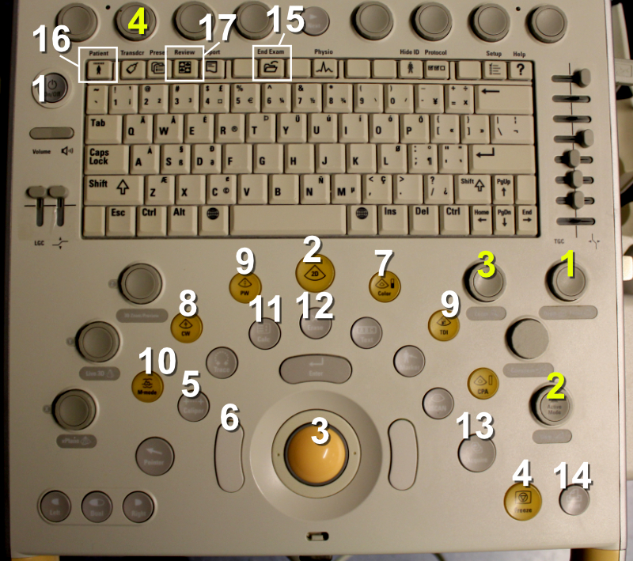

# UKG-laitteen nappulat

Alla näkyvässä kuvassa (Fig. \@ref(fig:ukglaite)) esitellään UKG-laitteen Philips CX50 keskeisimmät nappulat ja niiden toiminnot allekirjoittaneen arvioimassa tärkeysjärjestyksessä.

***Huom! Nappuloita ei tarvitse opetella ulkoa tässä yhteydessä - ne käsitellään myöhemmin kunkin esiteltävän toiminnon yhteydessä tässä oppaassa.***

<br />


(ref:ukglaite) UKG-laitteen Philips CX50 nappulat.

```{r ukglaite, out.width = '100%', echo=FALSE, fig.cap="(ref:ukglaite)"}
 
```


<br/>
<br/>

Philips CX 50 -laitteen keskeisimpiä nappuloita:

1. **Virtanappula:** jo tätä painamalla pääsee erittäin pitkälle

2. **2D-nappula:** jos UKG-laite menee johonkin toimintoon, josta tahdotaan pois, yleensä tämän nappulan painaminen palauttaa laitteen "alkutilaan"

3. **Pallohiiri:** tällä voidaan liikuttaa mm. kursoria sekä zoomausikkunaa

4. **Freeze:** tällä liikkuvan kuvan saa pysäytettyä still-kuvaksi

5. **Caliper:** tällä saa tehtyä pikaisesti melkein mitä vain ns. "quick and dirty" -mittauksia ilman tarvetta mennä laitteen sisäisiin, rakenteisiin mittaussuureisiin (jälkimmäisiin pääsee Calc-nappulalla) 

6. **Pallohiiren vasen nappula:** tarpeellinen mm. kaikenlaisissa mittauksissa

7. **Color eli väridoppler:** käytännössä pakollinen esim. läppävuotojen ja -ahtaumien diagnostiikassa

8. **CW (continuous wave doppler) eli jatkuva doppler:** nopeiden verenvirtauksien mittauksessa tarvittava nappula

9. **PW (pulsed wave doppler) eli pulssidoppler:** hitaampien verenvirtauksien mittaamisessa vain tietystä, kursorilla osoitettavasta pisteestä tarvittava nappula

10. **M-mode:** M-moodilla saadaan tuotettua yksiulotteinen esitys tietystä sydämen leiketasosta ajan funktiona, mikä on erittäin hyödyllistä esimerkiksi vasemman kammion poikkimittojen ja samalla ejektiofraktion mittaamisessa

11. **Calc:** tällä nappulalla pystyy nimeämään rakenteisesti sydämestä otettuja mittoja, jolloin UKG-laite tuottaa automaattisesti erilaisia laskennallisia suureita sydämen toiminnasta (esim. ejektiofraktio ja aorttaläpän avautumispinta-ala)

12. **Erase:** tällä pystyy poistamaan näytöltä esim. erheelliseksi arvioidun mittauksen

13. **Acquire:** tällä pystyy tallentamaan ottamiaan kuvia ja videoita UKG-laitteen muistiin

14. **Print:** tämä tulostaa näytöllä näkyvän kuvan UKG-laitteeseen kytketylle tulostimelle

15. **End exam:** tällä saa lopetettua käynnissä olevan tutkimuksen ja nollattua kaikki tallennetut mittaukset, kuvat ja videot - jos Acquire-nappulalla on tehty tallennuksia, nämä jäävät UKG-laitteen massamuistille

16. **Patient:** tutkittavan tunnistetiedot saa syötettyä tämän painikkeen takaa avautuvalla näytöllä

17. **Review:** UKG-laitteelle tallennettuja kuvia ja videoita saa katseltua tämän painikkeen takaa avautuvalla näytöllä


<br/>
<br/>

Philips CX 50 -laitteen keskeisimpiä "potikoita":

1. **Depth:** tällä saa laajennettua tai kavennettua kuva-alaa UKG-laitteen näytöllä

2. **Gain:** tällä saa kuvaa joko tummemmaksi tai vaaleammaksi

3. **Zoom:** tällä saa zoomattua kuvaa

4. **"Baseline-potikka":** tämä on keskeisin ylärivin potikoista - sillä saa laskettua tai nostettua baselinea (= Y-akselin origoa) esim. jatkuvaa doppleria käytettäessä


<br/>
<br/>
<br/>
<p xmlns:cc="http://creativecommons.org/ns#" xmlns:dct="http://purl.org/dc/terms/"><a property="dct:title" rel="cc:attributionURL" href="https://vldesign.kapsi.fi/echo/">UKG:n suoritus - esimerkkinä Philips CX50 -laitteen toiminnot</a> by <a rel="cc:attributionURL dct:creator" property="cc:attributionName" href="http://www.linkedin.com/in/ville-langen">Ville Langén</a> is licensed under <a href="http://creativecommons.org/licenses/by-sa/4.0/?ref=chooser-v1" target="_blank" rel="license noopener noreferrer" style="display:inline-block;">CC BY-SA 4.0</a></p>