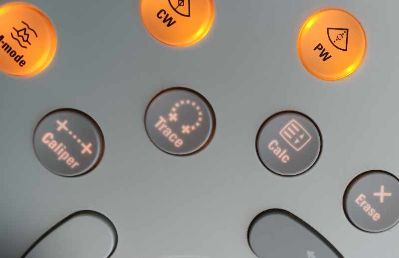

# Caliper vs. Calc

Olen vuosien varrella havainnut, että aloittelevilla ekkoajilla voi olla pitkäänkin vaikeuksia erottaa seuraavat kaksi mittaustapaa toisistaan:

1. "Nimetön" jonkin suureen mittaus Caliper-nappulalla
2. Rakenteisesti tehty mittaus Calc-nappulan takaa löytyvillä suureilla


<br />


(ref:caliperjacalc) Caliper- ja Calc-nappulat.

```{r caliperjacalc, out.width = '100%', echo=FALSE, fig.cap="(ref:caliperjacalc)"}
 
```


<br/>

Mittaustapojen ainoa ero on, että Caliper-nappulalla tehdystä mittauksesta vain itse mittaaja, siis ekkoaja, tietää mitä on mitattu.

Jos tahtoo UKG-laitteen laskevan esim. ejektiofraktion, laitteen kanssa on mitattava rakenteisesti - Calc-nappulan takaa suureita hakien - seuraavat mitat:

1. LVIDd (vasemman kammion läpimitta diastolessa)
2. LVIDs (vasemman kammion lämpimitta systolessa)

Välittömästi kun nämä mittaukset on rakenteisesti tehty, UKG-laite ilmoittaa näytöllä automaattisesti vasemman kammion ejektiofraktion, pyysi sitä ekkoaja tai ei.

Jos taas mittaa kummankin edellä mainitun mitan Caliper-painikkeella, laitteelle tämä näyttäytyy seuraavasti:

1. Äsken mitattiin jokin tuntematon Caliper-mitta
2. Sitten mitattiin jokin toinen tuntematon Caliper-mitta

<br/>

***Käytännön työssä kokenut ekkoaja ja kliinikko saattaa suorittaa varsinkin lääkärinkierrolla useita tutkimuksia perätysten käyttämällä pelkkää Caliper-toimintoa sen nopeuden vuoksi, saaden silti riittävän käsityksen kliinisesti merkittävistä UKG-löydöksistä niin lausunnon laatimista kuin varsinaista hoitoakin koskien.***

<br/>

Tyypillisiä mittauksia, jotka voi nopeasti katsoa "nimettömästi" Caliper-painikkeella:

- Vasemman kammion läpimitta
   - jos tämän katsoo vain Caliper-painikkeella, ei ekkoajalla toki ole aikomustakaan mittauttaa UKG-laitteella ejektiofraktiota
- Aortan ja vasemman eteisen läpimitat
- Aorttaläpän yli mitattu maksimigradientti jatkuvalla dopplerilla
- Trikuspidaaligradientti
- TAPSE

Tyypillisiä mittauksia, jotka usein tahtoo merkitä rakenteisesti Calc-nappulan takaa löytyvillä suureilla:

- Vasemman kammion läpimitta diastolessa ja systolessa
   - kun halutaan, että UKG-laite laskee ejektiofraktion
- E-, A- sekä e'-aalto
   - kun halutaan UKG-laitteen suorittavan diastoliikan laskutoimenpiteitä
- Aorttaläpän yli ja vasemmasta ulosvirtauskanavasta mitatut virtausnopeudet sekä ulosvirtauskanavan halkaisija
   - kun halutaan, että UKG-laite laskee aorttaläpän avautumispinta-alan (AVAn)


<br/>
<br/>
<p xmlns:cc="http://creativecommons.org/ns#" xmlns:dct="http://purl.org/dc/terms/"><a property="dct:title" rel="cc:attributionURL" href="https://vldesign.kapsi.fi/echo/">UKG:n suoritus - esimerkkinä Philips CX50 -laitteen toiminnot</a> by <a rel="cc:attributionURL dct:creator" property="cc:attributionName" href="http://www.linkedin.com/in/ville-langen">Ville Langén</a> is licensed under <a href="http://creativecommons.org/licenses/by-sa/4.0/?ref=chooser-v1" target="_blank" rel="license noopener noreferrer" style="display:inline-block;">CC BY-SA 4.0</a></p>