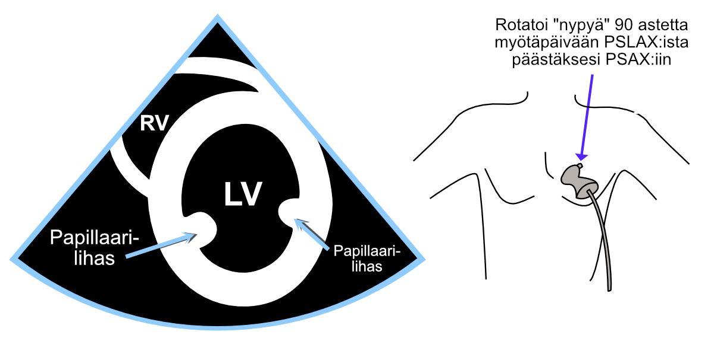
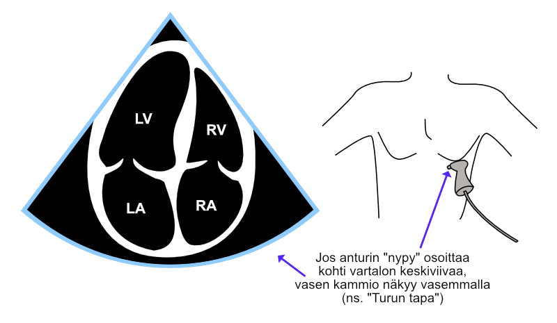
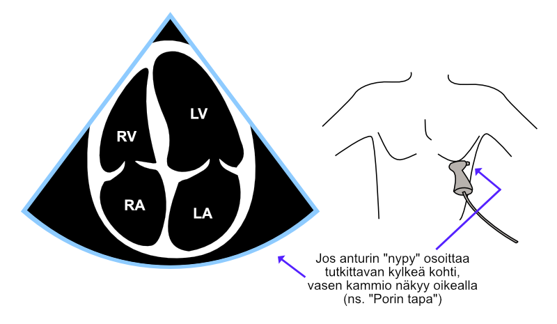

# Projektiot

UKG:ssa esiin saatavat näkymät aiheuttavat tulkintavaikeuksia vain aivan alkuvaiheen aloittelijoille.

UKG suoritetaan vain muutamasta standardinäkymästä eli projektiosta, joissa rakenteet näkyvät helposti aina "omilla paikoillaan". Projektiot oppii nopeasti, minkä jälkeen sydämen tavallisten rakenteiden - kuten läppien - hahmottaminen ei tuota minkäänlaisia vaikeuksia.

Projektioille on omat loogiset ja helpot kirjainlyhenteensä, jotka on syytä oppia. 

## PSLAX

Parasternaalinen pitkittäisprojektio (PSLAX, parasternal long axis view) saadaan kuvautumaan, kun anturi viedään rintalastan keskiosasta heti vasemmalle. Anturin "nypyn" pitää osoittaa kohti tutkittavan rintalastaa / oikeaa kainaloa.

<br />


(ref:pslax) Parasternaalinen pitkittäisprojektio (PSLAX).

```{r pslax, out.width = '100%', echo=FALSE, fig.cap="(ref:pslax)"}
 knitr::include_graphics("images/pslax2.png")
```


## PSAX

Parasternaalinen poikittaisprojektio eli lyhyen akselin projektio (PSAX, parasternal short axis view) saadaan rotatoimalla anturia parasternaalisesta pitkittäisprojektiosta 90 astetta myötäpäivään. Joskus samalla anturin paikkaa pitää hivenen siirtää, jotta saadaan palautetuksi rotaation yhteydessä mahdollisesti hukattu näkyvyys kylkiluiden välistä sydämeen.

Tästä projektiosta pystyy skannaamaan aste asteelta koko vasemman kammion kaikki osat tilttaamalla (ei siis rotatoimalla!) anturia joko kohti aorttaa tai sydämen kärkeä. Ääriasennossa aorttaa kohti tiltatessa nähdään poikkileikkaus aorttaläpästä, ja vastaavasti ääriasennossa kohti sydämen kärkeä tiltatessa nähdään vain vasemman kammion kärki pienenä donitsilta näyttävänä projektiona.

Alla olevassa kuvassa \@ref(fig:psax) nähdään lyhyen akselin projektio vasemman kammion papillaarilihasten tasolta. 

Alempana näkyvässä kuvassa \@ref(fig:psaxtaivutuksia) esitellään PSAX-projektion eri tilttauksia (rotaatioaste pysyy koko ajan samana eli 90 asteessa myötäpäivään PSLAX:sta katsottuna).  


<br />


(ref:psax) Parasternaalinen lyhyen akselin projektio (PSAX).

```{r psax, out.width = '100%', echo=FALSE, fig.cap="(ref:psax)"}
 
```


<br />


(ref:psaxtaivutuksia) Parasternaalisen lyhyen akselin projektion tilttaaminen eri leiketasoille.

```{r psaxtaivutuksia, out.width = '100%', echo=FALSE, fig.cap="(ref:psaxtaivutuksia)"}
 knitr::include_graphics("images/psax_taivutuksia.png")
```


## A4C

### "Turun tapa"

Apikaalisesta projektiosta - joka joskus myös kärkikuvaksi kutsutaan - kuvataan nelilokerokuva (A4C, apical four chamber view) . Turun alueella tyypillisimmin anturin "nypy" suunnataan tutkittavan kehon keskiviivaa kohti, jolloin vasen kammio piirtyy kuva-alassa vasemmalle.

<br />


(ref:a4cturku) Nelilokerokuva (A4C) Turun malliin.

```{r a4cturku, out.width = '100%', echo=FALSE, fig.cap="(ref:a4cturku)"}
 
```

### "Porin tapa"

Jos sen sijaan "nypy" suunnataankin lateraalisesti osoittamaan kohti tutkittavan kylkeä, vasen kammio piirtyykin kuva-alassa oikealle - näin toimitaan esim. Porin kardiologialla.

<br />


(ref:a4cpori) Nelilokerokuva (A4C) Porin malliin.

```{r a4cpori, out.width = '100%', echo=FALSE, fig.cap="(ref:a4cpori)"}
 
```


## A5C

Viisilokerokuva (A5C, apical five chamber view) on verraten helppo muodostaa hakemalla ensin nelilokerokuvan ja kallistamalla sitten anturin kärkeä hiukan ventraalisesti. Vastaavasti nelilokerokuvaan pääsee takaisin kallistamalla anturin kärkeä takaisin hivenen dorsaalisuuntaan.

Viisilokerokuvan tärkein merkitys on aorttaläppään kohdistuvat tarkastelut ja mittaukset esim. väridopplerilla ja jatkuvalla dopplerilla.

Joskus anturin ventraalinen kallistus tuntuu hävittävän näkyvyyden kokonaan, ja joskus aortta avautuu niin vinosti, ettei aorttaläpän yli pysty tekemään mittauksia jatkuvalla dopplerilla. Näissä tapauksissa usein auttaa, kun koko anturia siirtää kylkiluuta pitkin jonkin matkaa kohti potilaan kylkeä ("kohti kainaloa").

<br />


(ref:a5c) Viisilokerokuva (A5C).

```{r a5c, out.width = '100%', echo=FALSE, fig.cap="(ref:a5c)"}
 knitr::include_graphics("images/a5c_and_body_turku2.png")
```


## Subkostaaliprojektio

Subkostaaliprojektio saadaan sijoittamalla anturi vertikaalisesti heti miekkalisäkkeen kaudaalipuolelle, anturin "nypy" osoitettuna kraniaalisesti. Usein pieni kraniaalinen taivutus kohti sydäntä auttaa visualisoimaan oikean eteisen mukaan kuvaan (Kuva \@ref(fig:subkprojektio)). Lisäksi pieni maksaa kohden suunnattu taivutus, jota kutsun "maksatilttaukseksi", voi auttaa visualisoimaan alaonttolaskimon (IVC:n).

Subkostaaliprojektion "tilttauksia" käsitelty lisää luvussa \@ref(icvmittaus).

Subkostaalisesti voidaan tarkastella Kuvassa \@ref(fig:subkprojektio) esitellyn projektion ohella muitakin näkymiä sydämen eri lokeroista. Suosittelen [tästä linkistä löytyvää](https://www.youtube.com/watch?v=3y15C3mYocA) erinomaista GE HealthCaren ja prof. Thomas Binderin videota näistä projektioista. Suosittelen myös YouTube-kanavan BASIC Critical Care Ultrasound [tästä linkistä](https://www.youtube.com/watch?v=MXCvktFy72E) löytyvää videota, jossa esitellään lisäksi subkostaalinen lyhyen akselin projektio.


<br />


(ref:subkprojektio) Subkostaaliprojektio.

```{r subkprojektio, out.width = '100%', echo=FALSE,fig.cap="(ref:subkprojektio)"}
 knitr::include_graphics("images/subcostal_and_body.png")
```


<br/>
<br/>
<br/>
<p xmlns:cc="http://creativecommons.org/ns#" xmlns:dct="http://purl.org/dc/terms/"><a property="dct:title" rel="cc:attributionURL" href="https://vldesign.kapsi.fi/echo/">UKG:n suoritus - esimerkkinä Philips CX50 -laitteen toiminnot</a> by <a rel="cc:attributionURL dct:creator" property="cc:attributionName" href="http://www.linkedin.com/in/ville-langen">Ville Langén</a> is licensed under <a href="http://creativecommons.org/licenses/by-sa/4.0/?ref=chooser-v1" target="_blank" rel="license noopener noreferrer" style="display:inline-block;">CC BY-SA 4.0</a></p>
