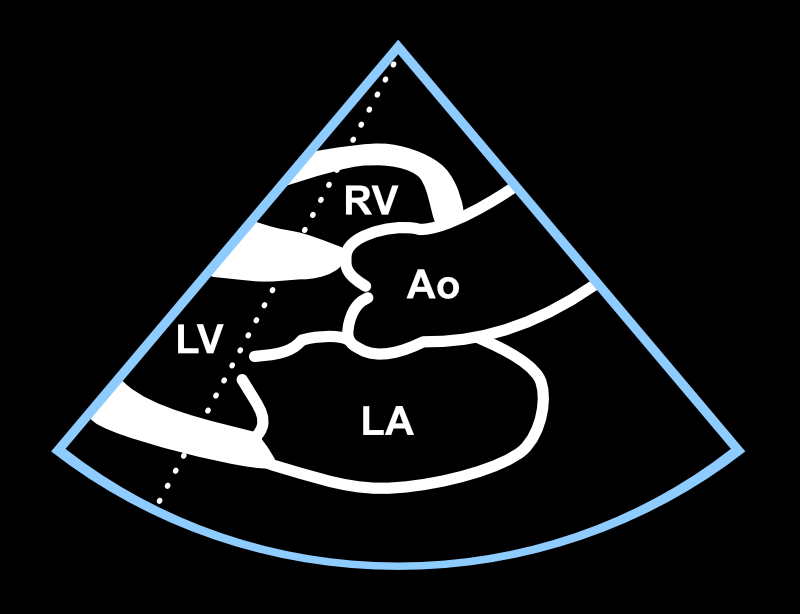
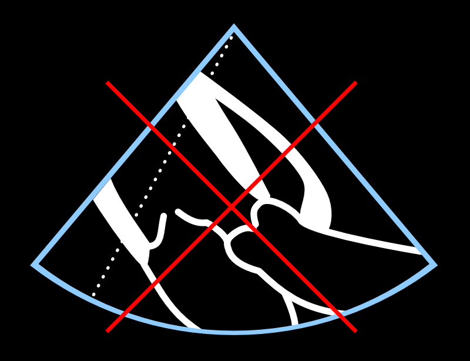
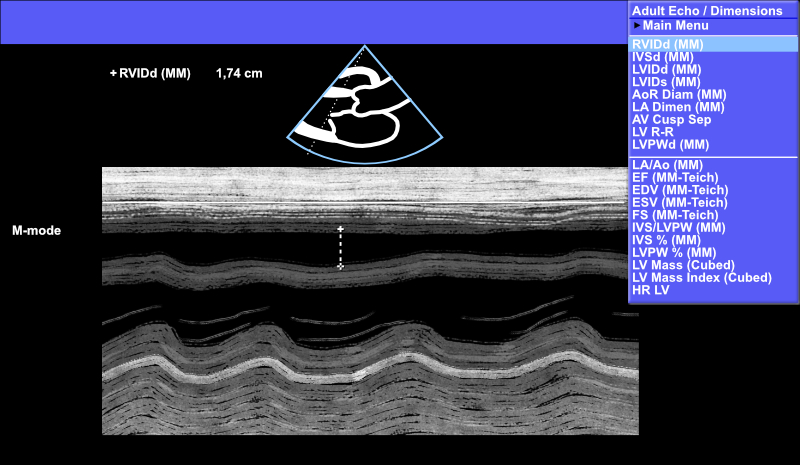
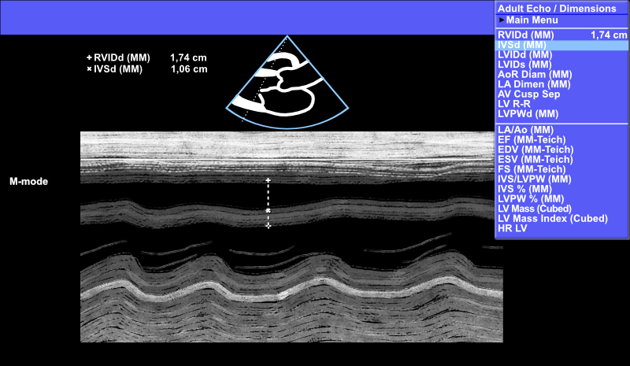
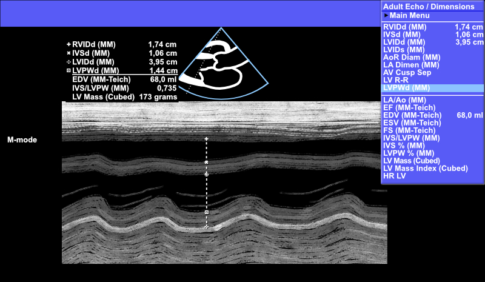
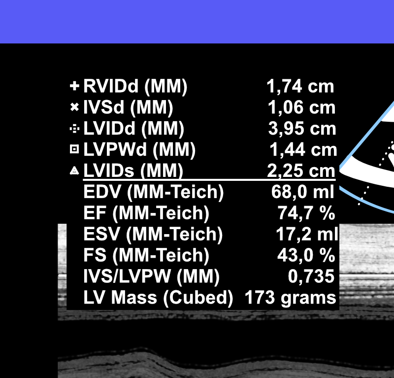

# Vasemman kammion mitat

## M-moodi{#mmoodi}

Jos näkyvyys on hyvä ja tutkittavan sydämen asento kuvaustekniikkaa ajatellen sopiva (Kuva \@ref(fig:mmoodimallikuva)), saadaan M-moodimittauksella nopeasti paljon hyödyllistä tietoa tutkittavan sydämestä.

M-moodin aikaansaamiseksi ja sillä mittausten tekemiseksi tarvitaan alla olevassa kuvassa osoitettuja nappuloita (Kuva \@ref(fig:ukglaitemmode)).

<br />

(ref:ukglaitemmode) M-moodin aikaansaamiseksi tarvittavat nappulat ja pallohiiri.

```{r ukglaitemmode, out.width = '100%', echo=FALSE, fig.cap="(ref:ukglaitemmode)", fig.margin = TRUE}
 knitr::include_graphics("images/ukglaite_mmode.jpg")
```

<br />


## Hae hyvä PSLAX

UKG-laite käynnistyy tavanomaisessa 2D-moodissa. Kyseisessä moodissa aivan ensimmäiseksi haetaan sydämestä hyvä PSLAX-projektio (Kuva \@ref(fig:mmoodimallikuva)). Heikkotasoista kuvaa ei pysty käyttämään luotettavasti M-moodimittauksiin.

Tämän jälkeen valitaan sopiva leikkauslinja liikuttelemalla kursoria UKG-laitteen ***pallohiirellä*** (track ball). Tarkasteltava leikkauslinja asetetaan siten, että se katkaisee kohtisuorasti vasemman kammion heti mitraaliläpän avautuvien purjeiden kärkien distaalipuolelta (Kuva \@ref(fig:mmoodimallikuva)).


<br />

(ref:mmoodimallikuva) Laadukas PSLAX-projektio ja oikeaoppinen katkaisulinja.

```{r mmoodimallikuva, out.width = '100%', echo=FALSE, fig.cap="(ref:mmoodimallikuva)", fig.margin = TRUE}
 
```

<br />


## Ongelmana pysty sydän

Jos **sydämen asento** on tutkittavalla kovin **pysty** (Kuva \@ref(fig:pystysydan)), M-moodi ei katkaise vasenta kammiota kohtisuoraan, jolloin tuloksena on **liian vino leike vasemmasta kammiosta**. Tämä mm. yliarvioi vasemman kammion poikkimittaa. Jos kunnollista kohtisuoraa leikettä ei saa aikaiseksi, ei kannata haaskata aikaa M-moodin kanssa vaan käyttää esimerkiksi 2D-kuvasta tehtävää LVEF:n mittausta, joka on kuvattu jäljempänä alaluvussa \@ref(lvef2d).

<br />

(ref:pystysydan) Tämä ei ole kunnon PSLAX-projektio - älä yritä tehdä tällaisesta projektiosta mittauksia M-moodilla.

```{r pystysydan, out.width = '100%', echo=FALSE, fig.cap="(ref:pystysydan)", fig.margin = TRUE}
 
```

<br />


## Mitattavat suureet

Jos riittävän laadukas PSLAX-projektio ja sopiva katkaisulinja on saatu näkyviin, painetaan UKG-laitteesta nappulaa ***M-mode***.

M-moodi saa rullata eteenpäin, ja jos näkymä näyttää teknisesti riittävän laadukkaalta mittauksia varten, kuva pysäytetään UKG-laitteen nappulalla ***Freeze*** (Kuva \@ref(fig:mmoodiperusnakyma)).

Varsinaiset mittaukset pysäytetystä kuvasta tehdään valitsemalla aina ensin mitattava suure (esim. vasemman kammion poikkimitta diastolessa jne.) nappulaa ***Calc*** painamalla avautuvista valikoista. Tästä kerrotaan tarkemmin jäljempänä.

<br />

(ref:mmoodiperusnakyma) M-moodin perusnäkymä PSLAX-projektiossa.

```{r mmoodiperusnakyma, out.width = '100%', echo=FALSE, fig.cap="(ref:mmoodiperusnakyma)", fig.margin = TRUE}
 knitr::include_graphics("images/mmoodiperusnakyma.jpg")
```

<br />


### RV:n mittaus

Oikea kammio (RV) hyvin harvoin mitataan tässä yhteydessä ja projektiossa, mutta täydellisyyden vuoksi esitetään myös RV:n mittaus M-moodista.

UKG-laitteen ***Calc***-nappulasta löytyy valikon ***Main Menu*** alta valikko ***Dimensions***. Valitse se, ja edelleen ***RVIDd (MM)***. Valinnat ja itse mittaus kuvasta tehdään pallohiirellä ja hiiren vasemmalla nappulalla.

Mittaa RV alla olevan esimerkkikuvan mukaisesti (Kuva \@ref(fig:mmoderv)).


<br />

(ref:mmoderv) Oikean kammion (RV) mittaus M-moodilla - harvoin tehty mittaus.

```{r mmoderv, out.width = '100%', echo=FALSE, fig.cap="(ref:mmoderv)", fig.margin = TRUE}
 
```

<br />

**Huom! Älä mittaa "veren päältä veren päälle" (siis mustan signaalin päältä mustan päälle) tässä tai muussakaan yhteydessä, vaan kudoksen signaalista (harmaasta) seuraavaan (ks. Kuva \@ref(fig:mmodervmagnified) ja Kuva \@ref(fig:mmodervmagnified2) alla).**

<br />

(ref:mmodervmagnified) Muista aina mitata kudoksen päältä kudoksen päälle (sydämen kudos näkyy harmaana, ei mustana).

```{r mmodervmagnified, out.width = '100%', echo=FALSE, fig.cap="(ref:mmodervmagnified)", fig.margin = TRUE}
 knitr::include_graphics("images/mmodervmagnified.jpg")
```

<br />


(ref:mmodervmagnified2) Älä mittaa "veren päältä veren päälle" (veri näkyy mustana signaalina).

```{r mmodervmagnified2, out.width = '100%', echo=FALSE, fig.cap="(ref:mmodervmagnified2)", fig.margin = TRUE}
 knitr::include_graphics("images/mmodervmagnified2.jpg")
```

<br />


### IVS:n mittaus

Yleisimmin mittaus aloitetaan nimenomaan kammioseptumista (IVS:sta) eli valitsemalla ensin ***Calc***-nappulan takaa ***Main Menu --> Dimensions --> IVSd (MM)***. Jos kuitenkin aloitit mittaamalla RV:n, UKG-laite siirtyy automaattisesti IVSd MM:n kohdalle.

Mittaa IVS alla olevan esimerkkikuvan mukaisesti (Kuva \@ref(fig:mmodeivs)).

<br />

(ref:mmodeivs) Kammioseptumin (IVS) mittaus M-moodilla.

```{r mmodeivs, out.width = '100%', echo=FALSE, fig.cap="(ref:mmodeivs)", fig.margin = TRUE}
 
```

<br />


### LV:n mittaus (diastole){#lvmmoodi}

Jos mittasit edellä IVS:n, UKG-laite siirtyy suoraan vasemman kammion diastolisen mitan (LVIDd) kohdalle.

Joskus kammioseptum demarkoituu niin huonosti M-moodissa, että tahdot aloittaa M-moodimittaukset suoraan LVIDd:n mittaamisella. Siinä tapauksessa valitaan ***Calc***-nappulan takaa ***Main Menu --> Dimensions --> LVIDd (MM)***, ja jätetään IVSd (ja RVIDd) tässä yhteydessä mittaamatta.

Mittaa LVIDd alla olevan esimerkkikuvan mukaisesti (Kuva \@ref(fig:mmodelvidd)).

<br />

(ref:mmodelvidd) Vasemman kammion diastolisen läpimitan (LVIDd) mittaus M-moodilla.

```{r mmodelvidd, out.width = '100%', echo=FALSE, fig.cap="(ref:mmodelvidd)", fig.margin = TRUE}
 knitr::include_graphics("images/mmodelvidd.jpg")
```

<br />


### LVPW:n mittaus

Jos mittasit edellä LVIDd:n, UKG-laite siirtyy suoraan vasemman kammion takaseinän (LVPWd) kohdalle.

Muussa tapauksessa voit hakea sen ***Calc***-nappulan takaa ***Main Menu --> Dimensions --> LVPWd (MM)***.


Mittaa LVPWd alla olevan esimerkkikuvan mukaisesti (Kuva \@ref(fig:mmodelvpwd)).

<br />

(ref:mmodelvpwd) Vasemman kammion takaseinän (LVPWd) mittaus M-moodilla.

```{r mmodelvpwd, out.width = '100%', echo=FALSE, fig.cap="(ref:mmodelvpwd)", fig.margin = TRUE}
 
```

<br />


### LV:n mittaus (systole)

Jos mittasit edellä LVPWd:n, UKG-laite siirtyy suoraan vasemman kammion mittaukseen systolessa (LVIDs).

Muussa tapauksessa voit hakea sen ***Calc***-nappulan takaa ***Main Menu --> Dimensions --> LVIDs (MM)***.


Mittaa LVIDs alla olevan esimerkkikuvan mukaisesti (Kuva \@ref(fig:mmodelvids)).

<br />

(ref:mmodelvids) Vasemman kammion systolisen läpimitan (LVIDs) mittaus M-moodilla.

```{r mmodelvids, out.width = '100%', echo=FALSE, fig.cap="(ref:mmodelvids)", fig.margin = TRUE}
 knitr::include_graphics("images/mmodelvids.jpg")
```

<br />

PSLAX-projektiossa M-moodissa tehtävistä mittauksista viimeinen on LVIDs-mitta. Tämän mitan saatuaan UKG-laite laskee ja ilmaisee "jakoviivan" alla keskeisiä laskennallisia suureita (ks. alla Kuva \@ref(fig:mmodelvidsmagnified)), joita ovat EDV, EF, ESV, FS, IVS/LVPW sekä LV Mass (Cubed).

**Turun seudulla on tyypillistä ilmaista laskennallisista suureista tässä yhteydessä itse mittojen lisäksi vain EF.**

Mileage may vary - eri sairaanhoitopiireissä voi olla erilaiset käytännöt lausunnon laatimisessa. Jopa sana UKG on käytössä vain tietyillä paikkakunnilla, kun toisilla saatetaan sen asemesta puhua "ekkosta".

Turussa ilmaistaisiin M-moodimittaukset (jos RV:tä ei olisi mitattu) alla olevasta kuvasta ytimekkäästi seuraavasti:

<br />

|    *"LV 40/23, josta EF 75 %. Seinämät 11/14."*

<br />

Huomaa, että mitat ilmaistaan tässä yhteydessä millimetreissä, ilman yksikön "mm" ilmaisua.

<br />


(ref:mmodelvidsmagnified) Vasemmasta kammiosta M-moodimittauksella saatavia mittoja ja laskennallisia suureita.

```{r mmodelvidsmagnified, out.width = '100%', echo=FALSE, fig.cap="(ref:mmodelvidsmagnified)", fig.margin = TRUE}
 
```


<br />

## LVEF:n 2D-mittaus{#lvef2d}

Jos sopivaa leikkauslinjaa laadukasta M-moodia varten ei saada näkyviin, mikään ei estä mittaamasta vasemman kammion läpimittaa diastolessa ja systolessa suoraan 2D-kuvasta  (Kuva \@ref(fig:2defmittaus)).

Heti kun nämä mittaukset on tehty rakenteisesti, UKG-laite ilmoittaa vasemman kammion ejektiofraktion.

Tärkeintä on, että haet LVIDd- ja LVIDs-mitat Calc-nappulan takaa alavalikosta Dimensions, jotta UKG-laite tajuaa, mitä mittoja yrität parhaillaan ottaa.

<br />

***Toisin sanoen älä tee näitä mittauksia "nimettömän mittauksen" Caliper-painikkeella!*** 

<br />

(ref:2defmittaus) Vasemman kammion ejektiofraktion mittaus 2D-moodissa.

```{r 2defmittaus, out.width = '100%', echo=FALSE, fig.cap="(ref:2defmittaus)", fig.margin = TRUE}
 knitr::include_graphics("images/2d_ef_mittaus.png")
```

<br />


<br/>
<br/>
<br/>
<p xmlns:cc="http://creativecommons.org/ns#" xmlns:dct="http://purl.org/dc/terms/"><a property="dct:title" rel="cc:attributionURL" href="https://ukg-opas.netlify.app/">UKG-opas</a> © 2022 by <a rel="cc:attributionURL dct:creator" property="cc:attributionName" href="https://www.linkedin.com/in/ville-langen/">Ville Langén</a> is licensed under <a href="https://creativecommons.org/licenses/by-sa/4.0/?ref=chooser-v1" target="_blank" rel="license noopener noreferrer" style="display:inline-block;">CC BY-SA 4.0</a></p>
