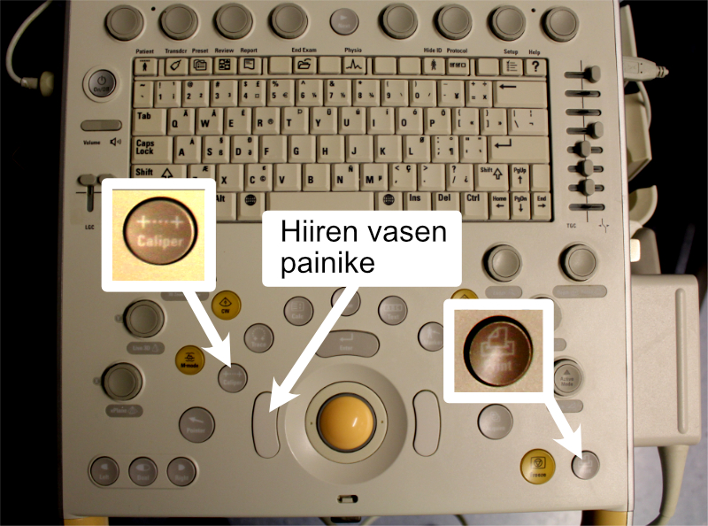

# Aortta (Ao)

## Aortan tyvi

Aloittelija voi yrittää painaa mieleensä lukeman 4 cm - yleisesti ottaen **aortan tyvi ei saisi olla yli 4 cm leveä**.

Mittaus suoritetaan kätevimmin UKG-laitteen 2D-kuvasta **Caliper-painikkeella** PSLAX-projektiossa. Lisäksi tarvitset hiiren vasenta painiketta sekä Print-painiketta (Kuva \@ref(fig:caliper)).

<br />


(ref:caliper) Caliper- ja Print-painikkeet sekä hiiren vasen painike.

```{r caliper, out.width = '100%', echo=FALSE, fig.cap="(ref:caliper)"}
 
```


<br />

Jos ilmaisee vain yhden mitan aortasta, se on käytännössä aina aortan tyvi, ja se merkitään varsin yleisesti pelkällä **lyhenteellä "Ao" lausuntoon**.

Mitataksesi aortan tyven, pysäytä ensin liikkuva 2D-kuva **Freeze**-painikkeella. Liikuta pallohiirellä pysäytettyä kuvasarjaa siten, että aorttaläppä sulkeutuu kiinni. Tämän jälkeen ensimmäinen Valsalvan sinus merkitään hiiren vasemmalla painikkeella, toinen suoraan Print-painikkeella, jolloin sinusten väliin jäävä jana tulee mitatuksi ja tulostetuksi (Kuva \@ref(fig:aortantyvi)).


<br />

(ref:aortantyvi) Aortan tyven mittaus 2D-kuvasta. Mittaus suoritetaan kun aorttaläppä on kiinni (loppudiastolessa).

```{r aortantyvi, out.width = '100%', echo=FALSE, fig.cap="(ref:aortantyvi)"}
 knitr::include_graphics("images/aortan_tyvi_end_diastolic3.png")
```


## Aortta: lisätietoa

### 2D- vs. M-moodimittaus

Aortan tyvi mitataan [nykysuositusten mukaan](https://www.asecho.org/guideline/recommendations-for-cardiac-chamber-quantification-by-echocardiography-in-adults-an-update-from-the-american-society-of-echocardiography-and-the-european-association-of-cardiovascular-imaging/) 2D-kuvasta. **Tarkoituksena on mitata maksimaalinen läpimitta yhden Valsalvan sinuksen pohjalta toisen pohjalle.**

Tulet näkemään, että monet kollegat käyttävät yhä M-moodia aortan tyven (ja samalla vasemman eteisen) mittaamiseen ja saattavat olla erittäin harjaantuneita tässä. Käytännössä M-moodin kursori on kuitenkin vaikea saada liikkuvassa kuvassa osumaan juuri sellaiseen kulmaan, että mitta tulee otetuksi Valsalvan sinuksien välistä maksimaalista läpimittaa kuvaavasti. **Siksi mittaan itse aina aortan mitat vain 2D-kuvasta.** Toinen syy on ajan säästäminen: koen itse, että M-moodissa riittävän hyvän kulman metsästämiseen menisi usein enemmän aikaa kuin välittömiin 2D-mittauksiin. Tässä oppaassa ei käsitellä aortan tyven mittausta M-moodilla.


### Aortan muut mitat

Koskien aortan mittojen raportointia kokemukseni on seuraava: jos Turun seudulla tehdyssä UKG:ssa käytetään termiä Ao, tällä kuvataan yleensä nimenomaan aortan tyveä. Tätä seuraa toisinaan - mutta ei suinkaan aina - muita aortan mittoja. Jos raportoit lausunnossasi useita aortan dimensioita, voi olla viisainta ettet käytä lyhennettä Ao ollenkaan vaan purat tuon lyhenteen auki muotoon "aortan tyvi".

Alan kattojärjestöt [ASE ja EACVI painottavat](https://www.asecho.org/guideline/recommendations-for-cardiac-chamber-quantification-by-echocardiography-in-adults-an-update-from-the-american-society-of-echocardiography-and-the-european-association-of-cardiovascular-imaging/), että ainoastaan aortan annuluksen mittaus suoritetaan keskisystolessa (Kuva \@ref(fig:annulus)), kaikki muut mitat loppudiastolessa (Kuva \@ref(fig:stj)). (Tosin aortan kaaren mittauksesta en ole löytänyt/lukenut näiden kattojärjestöjen suosituksia, joten en ole kiinnittänyt systole vs. diastole -kysymykseen suurta huomiota tuossa.)

<br />
<br />


```{r aorttataulukko, echo=FALSE, warning=FALSE, message=FALSE}
library(tidyverse)
library(kableExtra)

tibble::tribble(
 ~`Aortan dimensio`, ~Mittaushetki, ~`Keneltä mitataan`,
"Aortan annulus", "Keskisystole", "Esim. TAVI-leikattavat",
"Aortan tyvi", "Loppudiastole", "**Aina**",
"STJ", "Loppudiastole", "Vähintään silloin jos aortan dilataatio",
"ATA", "Loppudiastole", "Vähintään silloin jos aortan dilataatio",
"Aortan kaari", "(ei ohjeistusta)", "Vähintään silloin jos aortan dilataatio"
   ) -> aorttataulukko


knitr::kable((aorttataulukko), label=NA,
caption = 'Aortasta UKG:lla tyypillisesti mitattavia dimensioita.') %>%
footnote(
  general = "STJ, sinotubulaarijunktio. ATA, nouseva tubulaarinen aortta (ascending tubular aorta).",
  general_title = "Lyhenteet:",
)


```


<br />

(ref:stj) Sinotubulaarijunktio ja nouseva tubulaarinen aortta. Mittaus suoritetaan loppudiastolessa.

```{r stj, out.width = '100%', echo=FALSE, fig.cap="(ref:stj)"}
 knitr::include_graphics("images/aortta_stj_tub2.png")
```
<br />


<br />

(ref:annulus) Aortan annulus mitataan keskisystolessa.

```{r annulus, out.width = '100%', echo=FALSE, fig.cap="(ref:annulus)"}
 knitr::include_graphics("images/aortan_tyvi_annulus2.png")
```
<br />


[ASEn ja EACVI:n mukaan](https://www.asecho.org/guideline/recommendations-for-cardiac-chamber-quantification-by-echocardiography-in-adults-an-update-from-the-american-society-of-echocardiography-and-the-european-association-of-cardiovascular-imaging/) aortan mitat tulisi ilmaista ns. *leading edge-to-leading edge* -periaatteella. Selkeyden vuoksi tässä oppaassa kuitenkin esitetään kaikki 2D-kuvasta tehtävät läpimittamittaukset *inner edge-to-inner edge* -periaatteella. Rajaan näiden periaatteiden käsittelyn tämän oppaan ulkopuolelle. Voit halutessasi lukea asiasta lisää esim. [Oxborough'n ja kollegoiden artikkelista](https://www.researchgate.net/publication/262142708_Impact_of_Methodology_and_the_use_of_Allometric_Scaling_on_the_Echocardiographic_Assessment_of_the_Aortic_Root_and_Arch_A_Study_by_the_Research_and_Audit_Sub-Committee_of_the_British_Society_of_Echoca).


### Aortan viitearvot

Kuten edellä jo mainittu, aortan tyvi ei saisi olla yli 4 cm leveä.

Yleensä aortta kapenee sinotubulaarijunktion kohdalla, ja myös nouseva tubulaarinen aortta on kapeampi kuin aortan tyvi. Tarkempia yksilökohtaisia viitearvoja aortan eri dimensioista voi tarvittaessa tarkastella [hoitosuosituksista.](https://www.asecho.org/guideline/recommendations-for-cardiac-chamber-quantification-by-echocardiography-in-adults-an-update-from-the-american-society-of-echocardiography-and-the-european-association-of-cardiovascular-imaging/) 

<br/>
<br/>
<br/>
<p xmlns:cc="http://creativecommons.org/ns#" xmlns:dct="http://purl.org/dc/terms/"><a property="dct:title" rel="cc:attributionURL" href="https://ukg-opas.netlify.app/">UKG-opas</a> © 2022 by <a rel="cc:attributionURL dct:creator" property="cc:attributionName" href="https://www.linkedin.com/in/ville-langen/">Ville Langén</a> is licensed under <a href="https://creativecommons.org/licenses/by-sa/4.0/?ref=chooser-v1" target="_blank" rel="license noopener noreferrer" style="display:inline-block;">CC BY-SA 4.0</a></p>