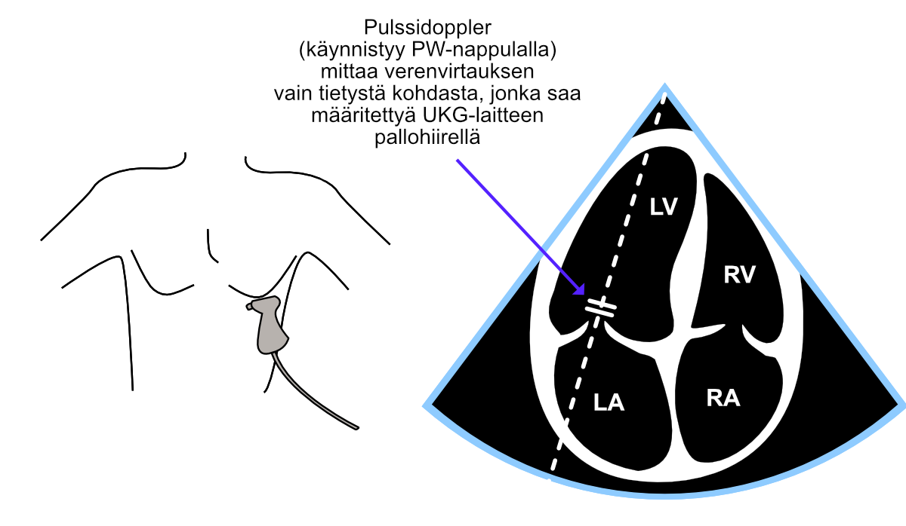
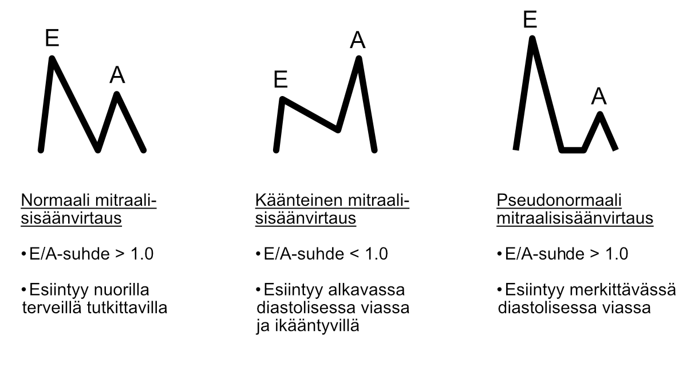

# Diastoliikka

Diastoliikan syvempää ymmärtämistä varten voi tutustua UKG:n kattojärjestöjen (ASE, American Society of Echocardiography, ja EACVI, European Association of Cardiovascular Imaging) [yhteiseen suositukseen diastolisen funktion arvioinnista UKG:lla](https://www.asecho.org/guideline/recommendations-for-the-evaluation-of-left-ventricular-diastolic-function-by-echocardiography-an-update-from-the-american-society-of-echocardiography-and-the-european-association-of-cardiovascular-im/). Kyseinen suositus ei lähde aivan mittauksien alkeista liikkeelle, joten ensin kannattaa mielestäni lukea tämä oppaani läpi.

Varsinkin aloittelevan ekkoajan kannattaisi mielestäni aloittaa seuraavasta kolmesta helposti opittavasta perusmittauksesta:

1. Mitraalisisäänvirtauksen eri aaltojen nopeuksien mittaus pulssidopplerilla (E- ja A-aallot)
2. Mitraaliläpän lateraaliannuluksesta tehtävä mittaus kudosdopplerilla (e'-aalto)
3. Vasemman kammion seinämäpaksuuksien arviointi

Edellisiä kolmea voivat vielä tarvittaessa tukea vasemman eteisen koon ja pulmonaalipaineen UKG-mittaukset.

## E- ja A-aalto

Jos tutkittava on sinusrytmissä, nähdään diastolessa mitraaliläpän avautuessa pulssidopplerilla tarkastellen kaksi erillistä aaltoa, jotka kuvaavat veren virtaamista vasempaan kammioon:

1) Ensin **E-aalto** (tulee sanasta *early*), joka syntyy mitraaliläpän avautuessa
   - virtaus vasempaan kammioon syntyy, koska vasemmassa eteisessä on tuolloin suurempi paine kuin vasemmassa kammiossa

2) Sitten **A-aalto** (tulee sanasta *atrium*)
   - virtaus yntyy vasemman eteisen supistuessa ja työntäessä verta vasempaan kammioon

***Huom. Jos tutkittava on eteisvärinässä, vasemmassa eteisessä ei ole kunnon supistelua vaan kaoottista värinää, jolloin A-aaltoa ei nähdä.***


<br />


(ref:diastoliikkaeaaallot) Mitraalisisäänvirtauksen mittaus nelilokerokuvasta.

```{r diastoliikkaeaaallot, out.width = '100%', echo=FALSE, fig.cap="(ref:diastoliikkaeaaallot)"}
 
```


<br />


Keskeisimmät mittaukset E- ja A-aalloista ovat kummankin aallon huippukohdat, jotka edustavat vastaavien verenvirtauksien maksiminopeutta. Näistä nopeuksista - ja niiden keskinäisestä suhteesta - pystyy tekemään seuraavia päätelmiä sydämen diastolisesta toiminnasta:

1. Nuorilla terveillä tutkittavilla E-aalto on suurempi kuin A-aalto
   - E/A-suhde > 1.0
2. Lievässä diastolisessa viassa ja ikääntyessä E/A-suhde muuttuu käänteiseksi
   - E/A-suhde < 1.0
3. Vaikeammassa diastolisessa viassa E/A-suhde muuttuu pseudonormaaliksi
   - E/A-suhde > 1.0
   
Koska yllä mainitut skenaariot 1 ja 3 muistuttavat visuaalisesti toisiaan  (Fig. \@ref(fig:mitraalisisaanvirtaus)), aloitteleva ekkoaja voi pohtia, että eikö tästä aiheudu huomattavia vaikeuksia päätellä, onko sydämen diastolinen toiminta täysin normaalia vaiko hyvinkin epänormaalia. Käytännössä kokeneemmalla ekkoajalla on harvemmin vaikeuksia normaalin ja pseudonormaalin mitraalisisäänvirtauksen erottamisessa toisistaan. Potilaan ikä ja UKG-tutkimuksessa tehtävät muut havainnot auttavat erottamaan nämä skenaariot toisistaan.

***Tärkeintä on mielestäni muistaa, että jos iäkkäällä henkilöllä näkee "normaalin" E/A-suhteen, se harvemmin jos koskaan on oikeasti normaali. Iäkkäillä tutkittavilla on käytännössä aina joko käänteinen mitraalisisäänvirtaus (skenaario 2 yllä) tai pseudonormaali mitraalisisäänvirtaus (skenaario 3 yllä). Jostain syystä tätä yksinkertaista muistisääntöä ei painoteta kirjallisuudessa.***


<br />


(ref:mitraalisisaanvirtaus) Mitraalisisäänvirtauksen eri skenaariot.

```{r mitraalisisaanvirtaus, out.width = '100%', echo=FALSE, fig.cap="(ref:mitraalisisaanvirtaus)"}
 
```


<br />


<br />


<br/>
<br/>
<br/>
<p xmlns:cc="http://creativecommons.org/ns#" xmlns:dct="http://purl.org/dc/terms/"><a property="dct:title" rel="cc:attributionURL" href="https://vldesign.kapsi.fi/echo/">UKG:n suoritus - esimerkkinä Philips CX50 -laitteen toiminnot</a> by <a rel="cc:attributionURL dct:creator" property="cc:attributionName" href="http://www.linkedin.com/in/ville-langen">Ville Langén</a> is licensed under <a href="http://creativecommons.org/licenses/by-sa/4.0/?ref=chooser-v1" target="_blank" rel="license noopener noreferrer" style="display:inline-block;">CC BY-SA 4.0</a></p>