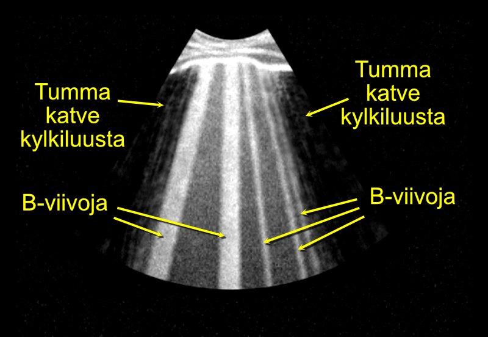

# Keuhkojen kongestion arviointi

## Pleuraneste

Suosittelen arvioimaan pleuranesteen määrää laittamalla anturin pystysuoraan asentoon keskiaksillaarilinjaan potilaan kylkeen. On mielestäni tärkeää pitää anturin markkeri aina osoittamassa kohti kainaloa, jolloin maksa näkyy kuvan vasemmassa laidassa ja keuhkot kuvan oikeassa laidassa - tällöin kuvan tulkinnassa ei ole koskaan vaikeuksia.

Keuhkokudoksen erottaa muista kudoksista helposti, koska keuhkoissa usein näkyy muutama komeetta (B-viiva), näistä lisää alempana. B-viivoja et sen sijaan löydä esim. maksasta.

Jos ajatuksissa on pleuranesteen punktointi syystä tai toisesta, keuhkojen etäisyyttä pistopaikasta kannattaa arvioida Caliper-nappulalla (ks. kuva 8.1 alla). Suosittelen perehtymään kirjallisuuteen - ja ennen kaikkea konsultoimaan senioria - koskien turvallista pistomarginaalia.

Huom! Jos otaksut potilaalla olevan pleuranesteylimäärää mutta et löydäkään sitä kaikukuvauslaitteella, anturi kannattaa sijoittaa aivan posteriorisesti, käytännössä niin, että se koskee jo lakanaa. Potilaan ollessa selinmakuulla pleuraneste näet hakeutuu posteriorisesti maan vetovoiman vuoksi.

<br />

(ref:keuhkot) Pleuranesteen määrän arvioiminen sydämen kaikukuvauslaitteella.

```{r keuhkot, out.width = '100%', echo=FALSE, fig.cap="(ref:keuhkot)", fig.margin = TRUE}
 knitr::include_graphics("images/lung_us.jpg")
```

<br />


## B-viivat

Itse keuhkokudoksen kosteus päätellään komeetoista eli B-viivoista. [Lichtensteinin ja Mezièren mukaan](https://www.ncbi.nlm.nih.gov/pmc/articles/PMC3734893/) kolme B-viivaa tai enemmän yhdessä näkymässä (käytännössä: yhdessä kylkiluuvälissä) on poikkeavaa. Suosittelen lämpimästi lukemaan lisää B-viivoista [heidän erinomaisesta artikkelistaan](https://www.ncbi.nlm.nih.gov/pmc/articles/PMC3734893/), joka on vapaasti luettavissa PubMed Centralissa - artikkelissa on runsaasti kuvia sekä suositus mittauspaikoista.

Niin ikään Via ym. ovat kirjoittaneet hyvin informatiivisen artikkelin aiheesta, joka on runsaine kuvineen ladattavissa vapaasti [Minerva Anestesiologican sivuilta](https://www.minervamedica.it/en/journals/minerva-anestesiologica/article.php?cod=R02Y2012N11A1282) (sieltä löytyy suora linkki kyseisen artikkelin [pdf-tiedostoon](https://www.minervamedica.it/en/getfreepdf/NE9PMFI0bzhlMzlGOE1WY0x2QVk4bFpXSFduaDJlRzlSa21MM3psOFA1RE9LVUxpRmRSRkZwYndBM1NndWhRdA%253D%253D/R02Y2012N11A1282.pdf)).

Yllä mainituissa artikkeleissa kerrotaan myös tärkeää tietoa B-viivojen erotusdiagnostiikasta - B-viivat eivät ole aina osoitus keuhkokongestiosta vaan voivat kieliä mm. pneumoniasta.

B-viivat ovat elävän elämän osoitus Goethen viisaudesta:"You see only what you know". Monet kaikukardiografiaa ammatikseen tekevät näkevät tuhansia kertoja elämässään B-viivoja "vahingossa" sydäntä kuvatessaan, mutta eivät ymmärrä niiden merkitystä.


<br />

(ref:bviivat) Keuhkokongestion arviointi B-viivoja etsimällä.

```{r bviivat, out.width = '100%', echo=FALSE, fig.cap="(ref:bviivat)", fig.margin = TRUE}
 
```

 

<br/>
<br/>
<br/>
<p xmlns:cc="http://creativecommons.org/ns#" xmlns:dct="http://purl.org/dc/terms/"><a property="dct:title" rel="cc:attributionURL" href="https://vldesign.kapsi.fi/echo/">UKG:n suoritus - esimerkkinä Philips CX50 -laitteen toiminnot</a> by <a rel="cc:attributionURL dct:creator" property="cc:attributionName" href="http://www.linkedin.com/in/ville-langen">Ville Langén</a> is licensed under <a href="http://creativecommons.org/licenses/by-sa/4.0/?ref=chooser-v1" target="_blank" rel="license noopener noreferrer" style="display:inline-block;">CC BY-SA 4.0</a></p>


          