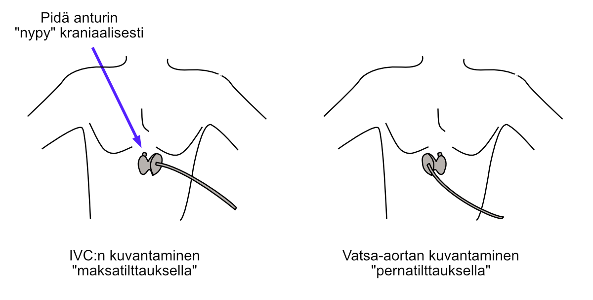

# IVC:n mittaus{#icvmittaus}

## Mittauspaikka

Aloittelevakin ekkoaja yleensä löytää alaonttolaskimon (IVC:n) melko helposti subkostaaliprojektiosta. Osalla tutkittavista subkostaali-ikkuna tosin ei tarjoa ollenkaan diagnostista näkyvyyttä, [minkä syynä voi olla esim. suolikaasu](https://pubmed.ncbi.nlm.nih.gov/38222871/).


Olen huomannut, että aloittelijat sotkevat mittauksissaan toisinaan alaonttolaskimon ja vatsa-aortan keskenään. Tämän ratkaisemiseksi olen lanseerannut periaatteen, jolla ne erottaa helposti toisistaan  (Kuva \@ref(fig:ivcmittauspaikka)):

1) ensin alaonttolaskimo identifioidaan taivutuksella, jota kutsun **"maksatilttaukseksi"**
2) tämän jälkeen vatsa-aortta identifioidaan **"pernatilttauksella"**.

Kun sekä alaonttolaskimo että vatsa-aortta on identifioitu, niitä ei pääse sotkemaan toisiinsa.


<br />

(ref:ivcmittauspaikka) Alaonttolaskimon ja vatsa-aortan identifiointi "maksa- ja pernatilttauksella".

```{r ivcmittauspaikka, out.width = '100%', echo=FALSE, fig.cap="(ref:ivcmittauspaikka)", fig.margin = TRUE}
 
```

<br />


## 2D-kuvamittaus

Suosittelen mittaamaan alaonttolaskimon (IVC:n) 2D-kuvasta. Usein M-moodista ei näet saa aivan kohtisuoraa leikettä IVC:stä, ja tällaisen leikkeen aikaansaamiseen menee suotta aikaa varsinkin aloittelijalta.

IVC:tä ei tulisi mitata aivan maksalaskimon kohdalta vaan siitä n. 1-3 cm "jalkoihin päihin", kuten alla olevassa kuvassa (Kuva \@ref(fig:ivc)) demonstroidaan.

IVC:stä otetaan kuvatallenne sekä ekspiriumin ja inspiriumin aikana. Erikseen ei tarvitse pohtia kumpi hengityksen vaihe olikaan menossa: tulee yksinkertaisesti mitata IVC samasta kohtaa laajimmillaan ja kapeimmillaan.

Suosittelen, että yrität saada hieman näkymää myös oikeaan eteiseen (Kuva \@ref(fig:ivc)). IVC yhdistyy oikeaan eteiseen, jolloin voit olla varma, että olet ottamassa mittauksia juuri IVC:stä. IVC:n identifioinnissa auttavat myös anturin tilttaukset, jotka jo esittelin yllä (Kuva \@ref(fig:ivcmittauspaikka)).

***Huom! IVC-mittausten rajoitukset nestetasapainon arviossa tulee tiedostaa!***

Suosittelen lukemaan esimerkiksi [Marikin ja kollegoiden katsauksen aiheesta.](https://www.sciencedirect.com/science/article/pii/S0012369208601634) Esimerkiksi [merkittävä trikuspidaalivuoto](https://pubmed.ncbi.nlm.nih.gov/27107754/) voi hankaloittaa voluumistatuksen arviota IVC:n perusteella, mistä allekirjoittaneellakin on runsaasti kliinistä kokemusta.

<br />

(ref:ivc) Alaonttolaskimon (IVC:n) läpimitan mittaaminen Caliper-nappulalla. Huom. Mittaa läpimitta sekä ekspiriumissa että inspiriumissa.

```{r ivc, out.width = '100%', echo=FALSE, fig.cap="(ref:ivc)", fig.margin = TRUE}
 knitr::include_graphics("images/ivc.jpg")
```

<br />


## CVP:n päättely IVC:stä

UKG:n kattojärjestöt ovat [esitelleet hyvin yksinkertaisen periaatteen](https://www.onlinejase.com/article/S0894-7317(10)00434-7/fulltext), jolla CVP:n saa hetkessä pääteltyä IVC:stä. Tämä periaate esitellään seuraavassa taulukossa.


<br />

```{r cvp, tidy=FALSE, echo=FALSE, warning=FALSE, message=FALSE}
library(tidyverse)
tibble::tribble(
                
        
   ~"Ehto",                                                     ~"CVP (mmHg)",     ~"Tulkinta",
                                 
   "IVC ≤ 2.1 cm ja supistuu 'sniffatessa' > 50 %",              "3",               "CVP normaali",
   "IVC > 2.1 cm ja supistuu 'sniffatessa' < 50 %",              "15",              "CVP suuri",
   "kaikki muut mahdolliset mittausskenaariot",                  "8",              "CVP kohtalainen"
   

  ) -> cvp_data

knitr::kable((cvp_data), booktabs = TRUE,
caption = 'CVP:n päättely IVC:stä.')


```


<br />

Esimerkkejä:

Löydös                            CVP (mmHg)
--------------------------------  ------------
IVC 1.5 cm ja supistuu > 50 %     3 
IVC 2.7 cm ja supistuu < 50 %     15         
IVC 1.5 cm mutta supistuu < 50 %  8          
IVC 2.7 mutta supistuu > 50 %     8          

<br/>
<br/>
<br/>
<p xmlns:cc="http://creativecommons.org/ns#" xmlns:dct="http://purl.org/dc/terms/"><a property="dct:title" rel="cc:attributionURL" href="https://ukg-opas.netlify.app/">UKG-opas</a> © 2022 by <a rel="cc:attributionURL dct:creator" property="cc:attributionName" href="https://www.linkedin.com/in/ville-langen/">Ville Langén</a> is licensed under <a href="https://creativecommons.org/licenses/by-sa/4.0/?ref=chooser-v1" target="_blank" rel="license noopener noreferrer" style="display:inline-block;">CC BY-SA 4.0</a></p>


          