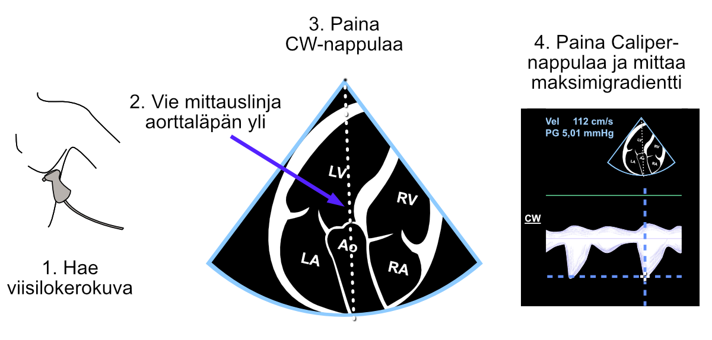

# Aorttastenoosi

[Euroopan Kardiologisen Seuran mukaan](https://academic.oup.com/eurheartj/article/43/7/561/6358470) aorttastenoosi on yleisin kajoavaa toimenpidettä vaativa läppävika Euroopassa ja Pohjois-Amerikassa.

UKG:ta opetteleva kliinikko oppii varsin nopeasti ihan visuaalisella tarkastelulla poissulkemaan aorttastenoosin ilman jatkuvalla ja pulssidopplerilla tehtäviä numeerisia mittauksia.

Seuraavassa on esiteltynä keskeisimpiä metodeja aorttastenoosin UKG-diagnostiikassa.

## Visuaalinen tarkastelu

Eritoten parasternaalinen pitkittäiskuva (PSLAX) ja poikittaiskuva (PSAX) ovat hyödyllisiä aorttaläpän avautumisliikkeen tarkastelussa. Jos läpässä on runsaasti kalkkia, ja sen avautumisliike vaikuttaa huonolta, tulee epäillä aorttastenoosia.

## Väridoppler

Jos verenvirtauksen tiellä ei ole rajoitteita kuten aorttastenoosia,  väridopplerin signaali kuvautuu yksivärisenä (laminaarinen virtaus). Tämä on kuvattu hienosti 123sonographyn YouTube-videossa, jonka löydät [tästä linkistä](https://www.youtube.com/watch?v=uJ5mtdqo1So).

Jos veri kulkeutuu ahtautuneen kanavan läpi, nähdään mosaiikkimainen väridopplerin signaali, jossa keltaiset värit korostuvat (turbulentti virtaus). Esimerkki tästä voidaan nähdä Mayo Clinicin YouTube-videossa noin kohdassa 1:55, [tässä linkki kyseiseen videoon](https://www.youtube.com/watch?v=tDloJNmdhuk).

Aina kun aorttaläppäpositiossa nähdään turbulentti virtaus, tulee epäillä aorttastenoosia.

## Jatkuva doppler

Jatkuva doppler on erittäin keskeinen aorttastenoosin diagnostiikassa. Mittauksen vaiheet on kuvattu alla (Kuva \@ref(fig:avgradientti)).

***Oma nyrkkisääntöni on, että jos jo Caliper-painikkeella vilkaistu nopeus on vähintään 4 m/s (vastaa 65 mmHg:n eroa vasemman kammion ja aortan välillä), vaikea-asteisen aorttastenoosin diagnoosi on selvä, eikä kliinikko välttämättä tarvitse tarkempia, Calc-nappulan takaa avautuvia mittauksia.***


<br />

(ref:avgradientti) Gradientin mittaus "nimettömästi" Caliper-painikkeella aorttaläpän yli jatkuvan dopplerin signaalista.

```{r avgradientti, out.width = '100%', echo=FALSE, fig.cap="(ref:avgradientti)"}
 
```
<br />

Varsinkin jos Caliper-nappulalla vilkaistu nopeus viittaa kohtalaiseen mutta ei vielä vaikea-asteiseen aorttastenoosiin, kannattaa lisäksi mitata aorttaläpän avautumispinta-ala (AVA) jatkuvuusyhtälöä hyödyntäen. Tällöin Caliper-nappulalla mitattu nopeus ei kelpaa yhtälöön, koska UKG-laite ei tajua, minkä nopeuden ekkoaja on sillä mitannut - mittaus täytyy tehdä rakenteisesti AV Vmax -suureena (tai AV VTI -suureena).


## Avautumispinta-ala (AVA){#AVA}

Aorttaläpän avautumispinta-alan (AVAn) mittaus suoritetaan jatkuvuusyhtälöä hyödyntäen. Onneksi jatkuvuusyhtälöä ei tarvitse itse syöttää, vaan UKG-laite laskee ja ilmoittaa sen välittömästi, kun seuraavat kolme suuretta on mitattu rakenteisesti (eli Calc-nappulan takaa avautuvia suureita mitatessa valiten):

1. Vasemman ulosvirtauskanavan (LVOT:n) läpimitta (Kuva \@ref(fig:lvotdiam))
2. Veren virtauksen nopeus aorttaläpän yli (Kuva \@ref(fig:asavmax))
3. Veren virtauksen nopeus ulosvirtauskanavassa (Kuva \@ref(fig:lvotpw))

Jatkuvuusyhtälö on ihan maalaisjärjellä ymmärrettävissä oleva asia. Voimme mitata veren virtaukseen liittyviä keskeisiä suureita LVOT:n kohdalla ja samaan aikaan tiedämme, ettei veri voi hävitä minnekään madonreikään LVOT:n jälkeen vaan sen on pakko käydä matkansa aorttaläpän läpi.

Täten 1) LVOT:sta tehty läpimitan (ja samalla pinta-alan) ja 2) veren virtauksen määrä auttaa laskemaan aorttaläpän avautumispinta-alan, kun kerran tiedämme 3) veren virtauksen myös aorttaläpän kohdalla. Nämä mittaukset on esitelty seuraavassa.

### LVOT:n läpimitta

Aivan ensimmäiseksi on mitattava LVOT:n läpimitta, josta UKG-laite sitten määrittää automaattisesti myös LVOT:n pinta-alan. LVOT:n mittaus tehdään rakenteisesti 2D-kuvasta (Kuva \@ref(fig:lvotdiam)).

***Huom. Älä käytä Caliper-painiketta LVOT:n mittaamiseen, koska silloin UKG-laite ei tiedä minkä rakenteen olet mitannut.*** 


<br />

(ref:lvotdiam) Vasemman ulosvirtauskanavan (LVOT:n) läpimitan mittaus.

```{r lvotdiam, out.width = '100%', echo=FALSE, fig.cap="(ref:lvotdiam)"}
 knitr::include_graphics("images/lvot2.png")
```

<br />


### CW-mittaus aorttaläpän yli


Tämän jälkeen tehdään jatkuvalla dopplerilla (CW) mittaus aorttaläpän yli. Jatkuvuusyhtälöön kelpaisi pelkkä maksiminopeuden mittaus, mutta on konventio piirtää koko varjokäyrä jatkuvan dopplerin signaalista aorttaläpän yli. Näin toimiessa saadaan maksimigradientin ohella kylkiäisenä myös keskigradientti aorttaläpän yli, ja ne kumpikin yleensä dokumentoidaan UKG-lausunnossa (Kuva \@ref(fig:asavmax)).


<br />

(ref:asavmax) Vasemman ulosvirtauskanavan (LVOT:n) läpimittan mittaus.

```{r asavmax, out.width = '100%', echo=FALSE, fig.cap="(ref:asavmax)"}
 knitr::include_graphics("images/aorttastenoosi_avmax3.png")
```

<br />


### PW-mittaus LVOT:sta


Lopuksi mitataan vielä virtausnopeus pulssidopplerilla (PW) vasemmasta ulosvirtauskanavasta (LVOT:sta). Tässäkin jatkuvuusyhtälöön kelpaisi pelkkä maksiminopeuden mittaus, mutta on konventio piirtää koko varjokäyrä pulssidopplerin signaalista. Samalla saadaan AVAn lisäksi kylkiäisenä selville myös vasemman kammion iskutilavuus (stroke volume, SV), ja sekin voidaan dokumentoida UKG-lausunnossa. UKG-laite ilmoittaa AVA:n ja SV:n välittömästi kun LVOT:n läpimitta, virtausnopeus aorttaläpästä ja virtausnopeus LVOT:sta ovat mitattuina (Kuva \@ref(fig:lvotpw)).


<br />

(ref:lvotpw) Vasemman ulosvirtauskanavan (LVOT:n) läpimittan mittaus.

```{r lvotpw, out.width = '100%', echo=FALSE, fig.cap="(ref:lvotpw)"}
 knitr::include_graphics("images/aorttastenoosi_lvot.png")
```

<br />


***Jos UKG-laite ei ilmoita iskutilavuutta ja AVAa, teit jotain väärin. Tee uudelleen kaikki kohdassa \@ref(AVA) mainitut mittaukset rauhassa, muistaen koko ajan välttää Caliper-nappulaa juuri näissä mittauksissa.***


<br/>
<br/>
<br/>
<p xmlns:cc="http://creativecommons.org/ns#" xmlns:dct="http://purl.org/dc/terms/"><a property="dct:title" rel="cc:attributionURL" href="https://ukg-opas.netlify.app/">UKG-opas</a> © 2022 by <a rel="cc:attributionURL dct:creator" property="cc:attributionName" href="https://www.linkedin.com/in/ville-langen/">Ville Langén</a> is licensed under <a href="https://creativecommons.org/licenses/by-sa/4.0/?ref=chooser-v1" target="_blank" rel="license noopener noreferrer" style="display:inline-block;">CC BY-SA 4.0</a></p>


          