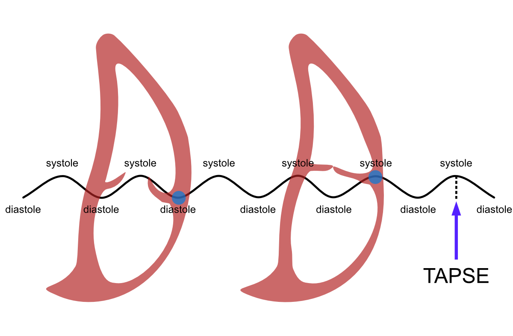
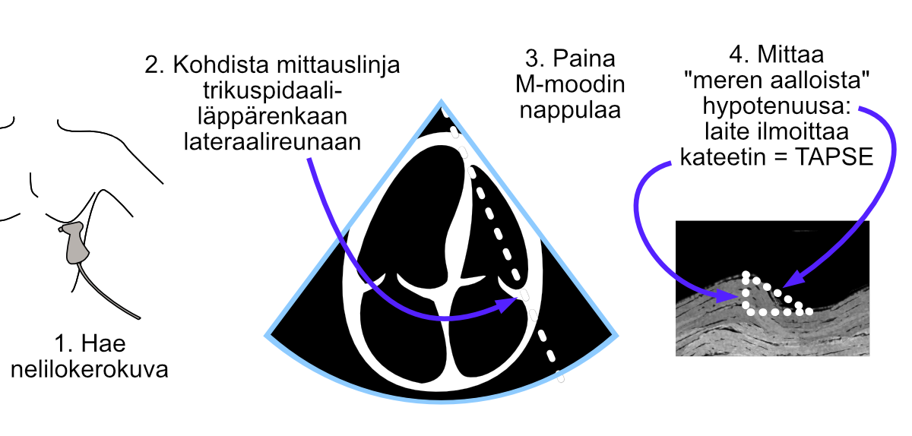
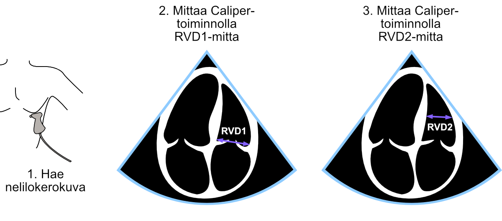

# Oikea kammio

Tässä kappaleessa tarkastellaan oikean kammion (RV) systolisen funktion ja läpimitan määrittämistä.

## Systolinen funktio

Edellä luvussa \@ref(mmoodi) käsiteltiin vasemman kammion basaalisen ejektiofraktion mittaamista [M-moodilla](#lvmmoodi) ja [2D-mittauksilla](#lvef2d). Kyseisissä mittauksissa hyödynnettiin yksinkertaistusta, jonka mukaan ***vasen kammio supistuu ennen kaikkea vaakasuunnassa***.

Oikean kammion kohdalla voidaan hyödyntää päinvastaista yksinkertaistusta, jonka mukaan ***oikea kammio supistuu ennen kaikkea pystysuunnassa***. Tätä ajattelutapaa noudattaen oikean kammion systolisesta funktiosta voidaankin saada käsitys mittaamalla trikuspidaaliläppärenkaan lateraalinurkan pystysuuntaisen liikkeen amplitudi. Tästä suureesta käytetään nimitystä **TAPSE** (*tricuspid annular plane systolic excursion*) (Kuva \@ref(fig:tapseaallot)).


<br />

(ref:tapseaallot) TAPSEn määritelmä. Kun tarkastelupisteenä (sininen pallo) on trikuspidaaliläppärenkaan lateraalireuna, oikean kammion liikehdintä diastolen ja systolen välillä piirtää "meren aaltojen" kaltaista liikettä. Tämän aaltoliikkeen amplitudi on TAPSE.

```{r tapseaallot, out.width = '100%', echo=FALSE, fig.cap="(ref:tapseaallot)"}
 
```

<br />


### TAPSEn mittaus

Mittaus suoritetaan seuraavasti:

1. Haetaan edustava nelilokerokuva, jossa saadaan mittauslinja sydämen kärjestä suoraan trikuspidaaliläppärenkaan lateraalireunaan

2. Aktivoidaan M-moodi painamalla sen nappulaa

3. Trikuspidaaliläppärengas alkaa piirtää "meren aaltoa", jolloin mitataan hypotenuusa aallon huipusta aallon pohjaan Caliper-nappulamittauksella. Huom! UKG-laite ei tällöin ilmoita hypotenuusaa vaan ***kateetin*** (aaltoliikkeen amplitudi) eli TAPSEn.

Mittauksen vaiheet on kuvattu alla (Kuva \@ref(fig:tapse)).


<br />

(ref:tapse) TAPSEn mittaus M-moodilla.

```{r tapse, out.width = '100%', echo=FALSE, fig.cap="(ref:tapse)"}
 
```

<br />

**TAPSEn mittaus on yleisesti ottaen erittäin helppoa.** Merkittävimmät aloittelijan haasteet:

- riittävän hyvän näkyvyyden saaminen sydämen oikeaan puoleen
- trikuspidaaliläppärenkaan erottaminen muista oikean kammion rakenteista M-moodikuvassa.

TAPSEn mittauksesta on erinomainen [The Echo Ladyn video](https://www.youtube.com/watch?v=jy0YxRagyXo) YouTubessa - voin suositella sitä lämpimästi aloittelijoille.

### TAPSEn viitealue

TAPSEn tulisi olla 17 mm tai yli. Tätä matalampaa arvoa pidetään viitteellisenä sille, että oikean kammion  systolinen funktion on alentunut.


## Läpimitta

Oikean kammion läpimitta määritetään diastolessa välittömästi trikuspidaaliläppärenkaan distaalipuolelta (sydämen kärjen puolelta). Tästä basaalisesta mitasta käytetään kirjallisuudesta lyhennettä **RVD1**.

Hieman harvemmin törmää kirjallisuudessa (ja vielä tätä harvemmin klinikassa) midventrikulaariseen mittaan, josta käytetään lyhennettä **RVD2**.


Mittauksen vaiheet on kuvattu alla (Kuva \@ref(fig:rvd1rvd2)). Mittaukset suoritetaan Caliper-painikkeella.


<br />

(ref:rvd1rvd2) RVD1- ja RVD2-mittausten suoritus.

```{r rvd1rvd2, out.width = '100%', echo=FALSE, fig.cap="(ref:rvd1rvd2)"}
 
```

<br />

### RV-mittojen viitealueet

Oikean kammion normaalit mitat on esitelty alla taulukossa \@ref(tab:rvd1rvd2refrange). Voit halutessasi lukea lisää aiheesta alan kattojärjestöjen suosituksesta [*Recommendations for Cardiac Chamber Quantification by Echocardiography in Adults*](https://academic.oup.com/ehjcimaging/article/16/3/233/2400086?login=true).


```{r rvd1rvd2refrange, echo=FALSE, warning=FALSE, message=FALSE}
library(tidyverse)
library(kableExtra)


tibble::tribble(
~`Kuvattava rakenne`,  ~`Keskiarvo ± SD`,   ~Viitealue,

"RVD1 (mm)", "33±4", "25-41",
"RVD2 (mm)", "27±4", "19-35"
) -> rvd1rvd2refrange


knitr::kable((rvd1rvd2refrange), 
caption = 'Oikean kammion normaalit mitat')


```


<br/> <br/> <br/>

<p xmlns:cc="http://creativecommons.org/ns#" xmlns:dct="http://purl.org/dc/terms/">

<a property="dct:title" rel="cc:attributionURL" href="https://ukg-opas.netlify.app/">UKG-opas</a> © 2022 by <a rel="cc:attributionURL dct:creator" property="cc:attributionName" href="https://www.linkedin.com/in/ville-langen/">Ville Langén</a> is licensed under <a href="https://creativecommons.org/licenses/by-sa/4.0/?ref=chooser-v1" target="_blank" rel="license noopener noreferrer" style="display:inline-block;">CC BY-SA 4.0</a>

</p>
